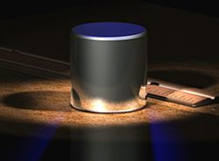
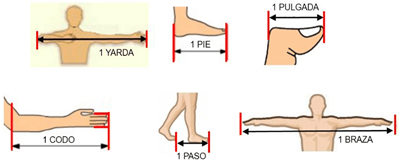

# Medidas y mediciones

**Medir** es cuantificar la unidad de una cosa comparándola con una ya establecida. Cuando hablamos de medir siempre nos referimos a una comparación, es decir, que necesitamos un punto de referencia para poder medir algo. Medir deriva del latín metriri que significa “comparar un resultado con una unidad de medida previa”.

Si medimos una mesa con lápiz y decimos que mide 7 lápices de largo. Entonces nuestra referencia es el lápiz, pero, si decidimos usar el mismo lápiz y con el tiempo se va gastando, la mesa ya no mide 7 lápices, puede que ahora mida 8 o 9, porque nuestra referencia a cambiado. Esto es lo que se denomina **medición arbitraria**, una medición con un instrumento o modelo poco definido.

## Sistema internacional

El Sistema Internacional de unidades, SI por sus siglas, un sistema aprobado por la comunidad científica internacional que define las 7 unidades fundamentales de la materia bajo un criterio o estándar absoluto: 

- **Longitud (m)**: es un concepto para determinar distancias.
- **Tiempo (s)**: es la magnitud que sirve para medir la duración o separación de uno o más acontecimientos.
- **Masa (kg)**: es la unidad de la cantidad de materia que posee un cuerpo físico.
- **Amperio (A)**: es la intensidad de la corriente eléctrica.
- **Kelvin (K)**: es una unidad para medir temperatura (así como lo es el Celsius y el Fahrenheit) 
- **Mol (mol)**: es la unidad de cantidad de sustancia
- **Candela (cd)**: es la unidad de intensidad luminosa.

::: info Un poquito de historia
El sistema internacional creó en 1960 por la 11.ª Conferencia General de Pesas y Medidas, está basado en el sistema métrico francés, fue creado en el siglo XVII como un nuevo método más fácil de medir, basado en un sistema decimal (diez), dado la mala fama de los sistemas de aquella época. El sistema métrico no vería su aprobación hasta 1875 donde se firmó la aprobación del metro.
:::

Las unidades fundamentales están basadas en cosas que pueden comparadas y constantes, por ejemplo, el kilogramo estaba basado u n cilindro de platino con pequeñas cantidades de iridio, sin embargo, se reportó una pérdida de 50 microgramos, se desconocen las razones (se asume que es por desgaste), pero debían hacer otra referencia que no cambiase con el tiempo. En el 2019 se redefinieron 4 de las 7 unidades fundamentales.

Un **patrón de unidad** o **patrón de medida**, son representaciones físicas de magnitudes físicas, estas se consideran inalterables y constantes. Sin embargo, como ya se mencionó, se cambió el patrón de varias unidades en el 2019, siendo ahora representadas por constantes matemáticas y no cosas materiales.

::: info 

El prototipo internacional del kilogramo, conocido popularmente como *«Gran K»*
:::

## Magnitud física

También llamado **cantidad o propiedad física**, es una cantidad medible de algún sistema físico, se mide con algún patrón de medida definido.

Las magnitudes físicas pueden ser el peso, volumen, densidad, velocidad de movimiento, dicho de otra forma, es toda propiedad física que pueda ser medida. Los colores, la textura, la belleza son conceptos muy subjetivos como para poder ser medidos, así que no son considerados magnitudes físicas, a pesar de ser aspectos físicos de los objetos.

## Medidas directas e indirectas

Las **medidas directas** son cuando usamos medidas o patrones establecidos usando instrumentos que den las unidades directamente.

Las **medidas indirectas** son cuando usamos objetos u otras medidas relacionadas con los patrones absolutos. Por ejemplo, si retomamos el ejemplo de la mesa y el lápiz, ahora decimos que el lápiz mide 10cm, se vuelve una medida indirecta, ya que el lápiz, a pesar de no ser un instrumento preciso, tiene una referencia con una unidad del sistema internacional o estándar.

Algo a mencionar es que las medidas obtenidas por medición indirecta tienen un grado de **incertidumbre** más alto que las directas (más adelante se hablará sobre la incertidumbre o error), dado a que se mide dos veces, una al objeto medido o **mensurando**, y otra al objeto medidor o **mensurador**.

## El sistema imperial

Este sistema se basa en las unidades de libra (masa), pulgada, pie, yarda, milla (longitud), onza (capacidad líquidos) … actualmente este sistema solo es usado de manera oficial por los Estados Unidos.

Su nombre viene dado a que fue un sistema impuesto por un imperio, más concretamente el imperio británico. Sin embargo, las unidades no fueron creadas por los británicos, este sistema se remonta desde la antigüedad, desde las civilizaciones más antiguas ha sufrido muchas evoluciones con el paso del tiempo, sus unidades eran la yarda, pie, codo, pulgada… es eran medidas obtenidas de las partes del cuerpo.

Para asegurar un estándar entre las unidades, ya que no todos tienen el mismo tamaño del pie, los monarcas del momento solían dictar los valores de estas unidades, también se solían usar las medidas del propio monarca como referencia. 

##  Preguntas para el estudiante

1. ¿para qué nos sirve medir?
2. ¿Qué objetos de medición conoces?
3. Toma una regla y empieza a medir diferentes objetos, ¡diviértete!
